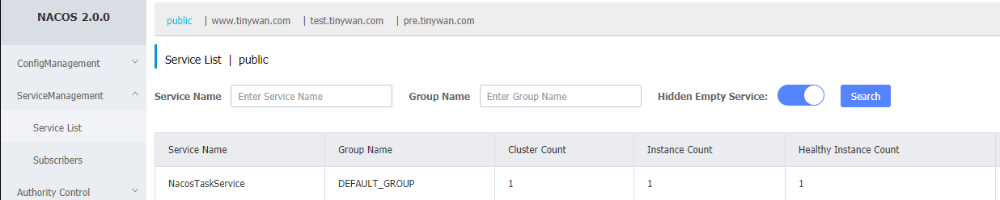

# Nacos-Sdk-PHP

[]()
[](https://996.icu)
[]()
[]()
[]()
[]()
[]()
[]()


## Nacos-Sdk-PHP

Nacos-Sdk-PHP for PHP client allows you to access Nacos OpenAPI. [Open API Guide](https://nacos.io/en-us/docs/open-api.html)

## Requirements

- PHP ^7.0
## Installation

```powershell
composer require tinywan/nacos-sdk-php
```
## Getting Started

```php
use Nacos\NacosClient;

$client = new NacosClient('localhost', 8848);

$dataId = 'database.php';
$group = 'DEFAULT_GROUP';
$result = $client->getConfig($dataId, $group);
```

if `nacos.core.auth.enabled=false`

```php
use Nacos\NacosClient;
use Nacos\NacosAuth;

$client = new NacosClient('localhost', 8848);

$auth = new NacosAuth($client);
$auth->login('nacos','nacos');
$dataId = 'database.php';
$group = 'DEFAULT_GROUP';
$result = $client->getConfig($dataId, $group);
```

## Use Namespace

```php
use Nacos\NacosClient;

$dataId = 'database.php';
$group = 'DEFAULT_GROUP';
$namespace = 'c78ce19d-82d1-456a-8552-9a0db6c11d01';

$client = new NacosClient('localhost', 8848);
$client->setNamespace($namespace);
$result = $client->getConfig($dataId, $group);
```
## Listener Config

```php
use Nacos\NacosClient;
use Nacos\Models\Config;

$dataId = 'database.php';
$group = 'DEFAULT_GROUP';
$namespace = 'c78ce19d-82d1-456a-8552-9a0db6c11d01';

$client = new NacosClient('localhost', 8848);
$client->setNamespace($namespace);
$client->setTimeout(3);
$content = $client->getConfig($dataId, $group);
$contentMd5 = md5($content);

$cache = new Config();
$cache->dataId = $dataId;
$cache->group = $group;
$cache->namespace = $namespace;
$cache->contentMd5 = $contentMd5;
$result = $client->listenConfig([$cache]);
if(!empty($result)) {
    $updateContent = $client->getConfig($dataId, $group);
    echo '[x] update content : ' . $updateContent, "\n";
} else {
    echo '[x] this is not update ', "\n";
}
```

## Register an instance to the service

```php
use Nacos\NacosClient;
use Nacos\Models\Config;

$client = new NacosClient('localhost', 8848);

$serviceName  = 'NacosTaskService';
$instance = new ServiceInstance();
$instance->serviceName = $serviceName;
$instance->ip = '127.0.0.1';
$instance->port = 80;
$instance->healthy = true;
$instance->ephemeral = false;

$isSuccess = $client->createInstance($instance);
if(true === $isSuccess) {
    echo '[x] create service instance success ', "\n";
} else {
    echo '[x] create service instance fail ', "\n";
}
```


## API
### Request Options

- setNamespace
  - string $namespace
- setTimeout
  - int $timeout
### Config API

- getConfig
  - string $dataId
  - string $group = NacosClient::DEFAULT_GROUP
- publishConfig
  - string $dataId
  - string $group
  - $content
- removeConfig
  - string $dataId
  - string $group = NacosClient::DEFAULT_GROUP
- listenConfig
  - array $configs
  - int $timeout = 30
### Naming API

- createInstance
  - ServiceInstance $instance
- deleteInstance
  - string $serviceName
  - string $ip
  - int $port
  - string $clusterName = null
  - string $namespaceId = null
- updateInstance
  - ServiceInstance $instance
- getInstanceList
  - string $serviceName
  - string $namespaceId = null
  - array $clusters = []
  - bool $healthyOnly = false
- getInstance
  - string $serviceName
  - string $ip
  - int $port
  - string $namespaceId = null
  - string $cluster = null
  - bool $healthyOnly = false
- sendInstanceBeat
  - string $serviceName
  - BeatInfo $beat
## PHPUnit Test

NacosClientTest
```
./vendor/bin/phpunit --bootstrap src/Nacos/NacosClient.php tests/NacosClientTest.php
```
- phpunit 调用命令行测试PHPUnit
- --bootstrap src/Nacos/NacosClient.php 指示PHPUnit命令行测试在测试之前执行　include src/Nacos/NacosClient.php
- tests/NacosClientTest.php 指示PHPUnit命令行测试要执行的测试 NacosClientTest 类声明在 tests/NacosClientTest.php
- http://www.phpunit.cn/getting-started.html

NacosConfig
```
./vendor/bin/phpunit --bootstrap src/Nacos/NacosConfig.php tests/NacosConfigTest.php
```

NacosNaming
```
./vendor/bin/phpunit --bootstrap src/Nacos/NacosNaming.php tests/NacosNamingTest.php
```
## Other

Docker Composer
```
docker run --rm --interactive --tty -v e:/GitHub/nacos-sdk-php:/app composer:1.10.16 install --ignore-platform-reqs
```

Git Tag
```
git push origin v0.0.42
// or push all
git push origin --tags
```